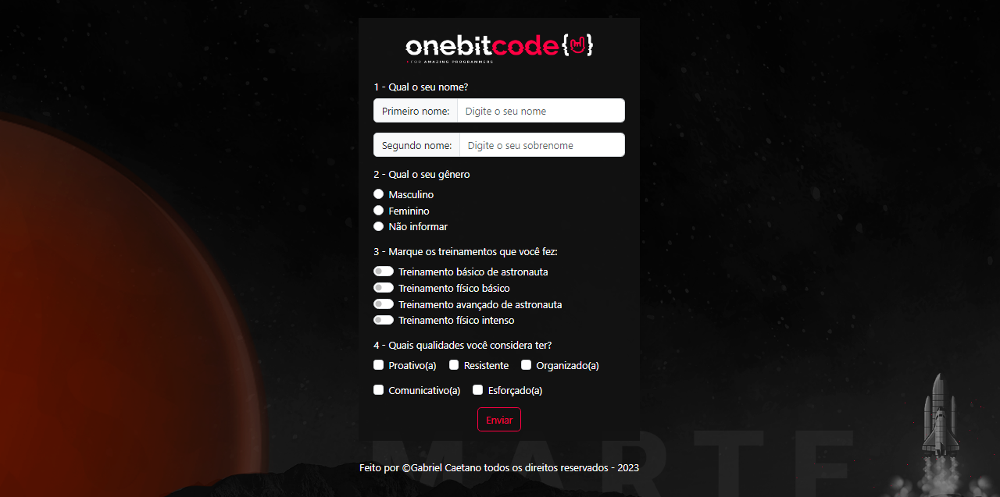

<h1 align="center"> Landing Page </h1>

Exercicio desenvolvido durante uma aula do curso Programador FullStack JavaScript da OneBitCode, a ideia é aplicar os conceitos do Sass junto com o bootstrap.  

  <a href="#-tecnologias">Tecnologias</a>&nbsp;&nbsp;&nbsp;|&nbsp;&nbsp;&nbsp;
  <a href="#-projeto">Projeto</a>&nbsp;&nbsp;&nbsp;

 

  

## 🚀 Tecnologias

Esse projeto foi desenvolvido com as seguintes tecnologias:

- HTML e CSS
- JavaScript
- Bootstrap
- Sass

## 💻 Projeto

Desenvolvido um formulário utilizando o Bootstrap junto com o Sass

- [Clique aqui para verificar](https://gabrielcaetano-landing-page.vercel.app/)